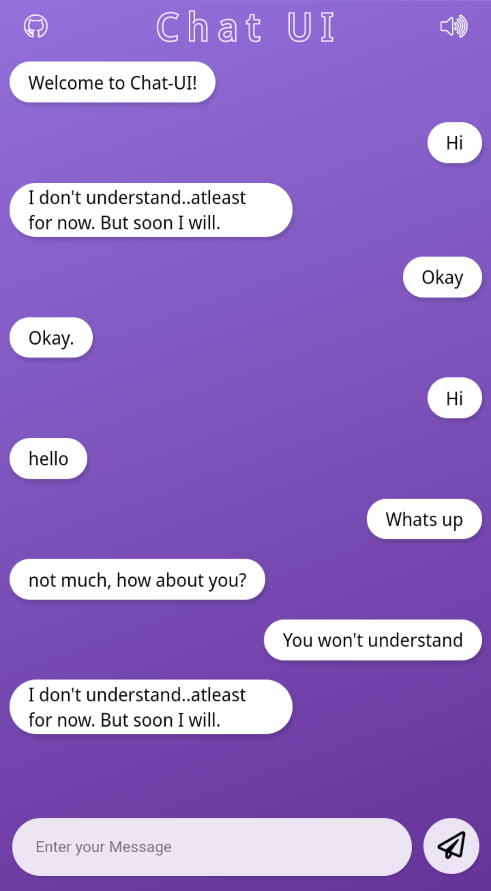

# Chat-UI
*User interface for a responsive chat screen in CSS best works for sites or apps that want to service customers through automated replies, the dataset is not only 100% customisable but also the easiest.*
